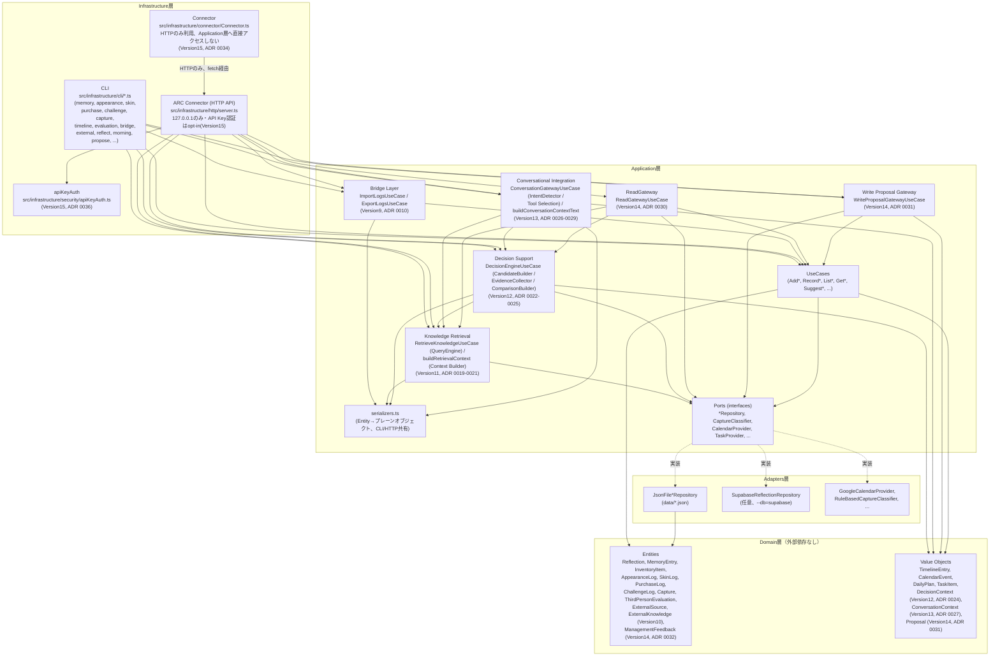
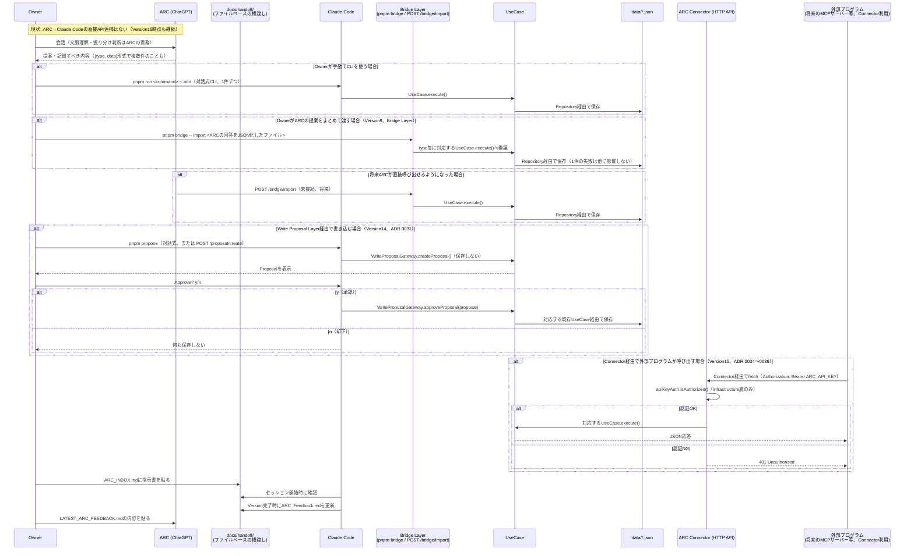
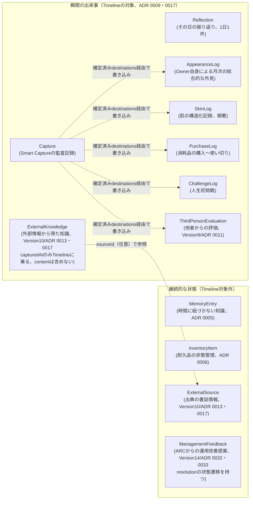

# Project ARC アーキテクチャ図

Version7完了時にOwnerから提案された、レイヤー構成・データの流れ・
ARCとの接続点を示す図（2026年7月、Version15時点の実装を反映。
Version9でBridge Layer・ThirdPersonEvaluation、Version10で
External Brain（ExternalSource/ExternalKnowledge）、Version11で
Knowledge Retrieval（RetrieveKnowledgeUseCase・Context Builder）、
Version12でDecision Support（DecisionEngineUseCase・
DecisionContext）、Version13でConversational Integration
（ConversationGatewayUseCase・ConversationContext）、Version14で
ARC Integration（ReadGatewayUseCase・WriteProposalGatewayUseCase・
ManagementFeedback）、Version15でConnector Deployment
（Connector・API Key認証）を追加）。
文章での説明は[`docs/architecture.md`](./architecture.md)を参照。

---

## 1. レイヤー構成（Clean Architecture）

依存の方向は常に外側→内側（Infrastructure/Adapters → Application →
Domain）。DomainとApplicationは、CLIかHTTP APIか、JSONファイルか
Supabaseかを一切知らない（Principle 8: 長期保守性）。Bridge Layer
（Version9）はApplication層に置かれた薄いディスパッチャであり、
新しい書き込みロジックは持たず既存UseCaseへ委譲する（ADR 0010）。
Knowledge Retrieval（Version11）は既存のExternalKnowledge/
ExternalSourceRepositoryをそのまま使い、新しい永続化層は追加しない
（指示書①「Repositoryはそのまま」、ADR 0019）。Decision Support
（Version12）はRetrieveKnowledgeUseCaseをそのまま再利用し、新しい
検索ロジックは持たない——DecisionContextはRepositoryを持たない
Value Object（永続化しない一時生成物、ADR 0024）であり、Bridgeの
対象にも含めない（ADR 0025）。Conversational Integration
（Version13）のConversationGatewayUseCaseは、RetrieveKnowledgeUseCase
とDecisionEngineUseCaseの「どちらを呼ぶか」を選ぶだけで、両者の
内部ロジックには一切手を入れない（ADR 0026・0028）。CLI/HTTP APIの
どちらからもConversationGatewayUseCase 1つを経由する、という点で
ARC Connectorの唯一の入口として機能する。

---

## 2. データの流れ（Owner・ARC・Systemの責務境界）

**Systemは判断しない**（`docs/ai-roles.md`、ADR 0007/0008/0010/0012/
0021/0023/0028）：UseCase層・Bridge Layerはどのログに書くべきかを
判断せず、確定済みの入力を忠実に保存するだけ。External Brainの
confidence・重複検知も同様に、Systemは材料を示すだけでOwner/ARCが
最終判断する（ADR 0012）。Knowledge Retrieval（Version11）の
Context Builderも「【External Brain】」の引用ブロックまでしか生成
せず、そこから先の解釈・結論（「【ARC】」部分）はARCが会話の中で
行う（ADR 0021）。Decision Support（Version12）のDecisionEngineも、
選択肢の整理・根拠からのメリット/デメリット抽出までに留め、優先
順位付けや結論は生成しない（ADR 0023）。Conversational Integration
（Version13）のConversationGatewayも、Intent判定（どのツールを
呼ぶか）だけを行い、回答内容の生成は一切しない——Context Injection
も同じ3セクション構造（【Retrieved Knowledge】【Decision Context】
【Sources】）までに留める（ADR 0028）。判断・解釈は常にARCまたは
Ownerの側で行われる。ARC Integration（Version14）のReadGatewayは
Timeline/Retrieval/Decisionへ`limit`必須で委譲するだけであり
（ADR 0030）、WriteProposalGatewayはOwnerが承認したProposalを
既存UseCaseへそのまま渡すだけで、Proposal自体は保存しない
（ADR 0031）——Systemが判断するのは「payloadの構造が正しいか」の
みで、内容の当否はOwnerが決める。Connector Deployment（Version15）の
Connectorは、Application層のUseCase/Repository/Domain Entityを
一切importせず、ARC Connector HTTP APIをHTTP経由でのみ呼び出す
（ADR 0034）——外部プログラム（将来のMCPサーバー・ChatGPT Actions
アダプタ等）から見た入口を、コンパイラレベルでも「HTTPしか話せない」
制約として表現する。API Key認証（`apiKeyAuth.ts`）もInfrastructure層
のみに閉じ込め、Application層は認証の存在を一切知らない（ADR 0036）。

---

## 3. Logの境界（どの記録がどこへ行くか）

`pnpm find`（横断検索、ADR 0005）はMemoryとInventoryのみを対象とする。
`pnpm external -- search`（ADR 0014）はExternalKnowledge/
ExternalSourceのみを対象とする独立した検索。`pnpm timeline`
（ADR 0009・0017）は上段の8つを対象とする（ExternalSource自体は
含めない）。`pnpm bridge`（Import/Export、ADR 0010・0015・0016）は
Captureを除く10種別（上段7つ + Memory + Inventory + ExternalSource）
を対象とする——目的ごとに対象範囲が異なる複数の横断機能が併存している。

---

## 4. ARCとの接続点（現状と将来）

| 接続点 | 現状（2026年7月、Version15時点） | 将来 |
|---|---|---|
| 指示の受け渡し | `docs/handoff/ARC_INBOX.md`にOwnerが手動で貼り付け（テキスト・PDF両対応） | 変更なし（人間による意思決定の窓口として維持、Principle 1） |
| フィードバックの受け渡し | `docs/reports/VersionN_ARC_Feedback.md`をOwnerが手動でコピー | 変更なし |
| データの一括受け渡し | `pnpm bridge -- import`でOwnerがARCの提案をJSONファイル経由で一括登録（ExternalSource/ExternalKnowledge含む）。`GET /bridge/export`で全データをJSON取得可能 | MCP/ChatGPT Actionsアダプタ経由でARCが直接`POST /bridge/import`を呼べるようになる可能性（Version16以降） |
| 知識の取得 | `POST /knowledge/retrieve`でquery/tags/topicsを渡すと、スコア順のKnowledge/Sourcesと引用ブロック（context）が返る（Version11、Owner経由で手動呼び出し） | Connector経由でARC側のプログラムが呼べる状態は整った。あとはMCP/Actionsアダプタの実装のみ（Version16） |
| 意思決定支援 | `POST /decision/support`でquestionを渡すと、選択肢・比較・根拠を整理したDecisionContextが返る（Version12、Owner経由で手動呼び出し）。ARCの解釈・優先順位提案はDecisionContextを受け取ったARC自身が会話の中で書く | 同上（Version16） |
| 会話への統合 | `POST /conversation/context`でquestionを渡すと、Intent判定に応じてRetrieve/Decisionへ自動的に振り分けられたConversationContextが返る（Version13、Owner経由で手動呼び出し）。Ownerが結果をコピペしてARCへ渡す運用は変わらない | 同上（Version16） |
| 読み取り（最小限） | `GET /read/reflection`・`/read/timeline`・`/read/external`・`/read/decision`が`limit`必須で最小限のデータを返す（Version14、ReadGatewayUseCase、ADR 0030）。`Connector`クラス経由で外部プログラムからも呼び出せる（Version15、ADR 0034） | MCP/Actionsアダプタが`Connector`をラップするだけで済む見込み |
| 書き込みの提案・承認 | `POST /proposal/create`でProposalを組み立て（保存されない）、Ownerが内容を確認した上で同じProposalを`POST /proposal/approve`（または`/reject`）へ再送して初めて書き込まれる（Version14、WriteProposalGatewayUseCase、ADR 0031）。`pnpm propose`または`Connector`クラス経由で同じ流れを実行可能（Version15） | ARCが`createProposal`まで直接呼び、Owner承認のUIだけを別途用意する形へ拡張できる可能性（承認ステップはUseCaseのインターフェースが強制するため設計変更は不要） |
| Connectorによる標準接続 | `src/infrastructure/connector/Connector.ts`がHTTP APIのみを利用するクライアントとして提供され、`ARC_API_KEY`設定時は`Authorization: Bearer`によるAPI Key認証が強制される（Version15、ADR 0034〜0036）。呼び出し元はまだOwnerが手動で動かすプログラム・テストのみ | MCPサーバー・ChatGPT Actionsアダプタが`Connector`と同じHTTP APIを呼ぶだけで接続できる（Version16、指示書19章） |
| 個別の読み書き | ARCから直接は不可能。ARC ConnectorはOwnerが手動で動かすCLI/プログラム、または`Connector`クラス経由での呼び出しが前提（`/external-sources`・`/external-knowledge`含む） | ChatGPT Actions・MCP等でARCが直接呼べるようになる可能性（Read Layerはそのまま、Write LayerはProposal経由のみ） |
| 判断・分類 | 常にARCまたはOwner（Systemは判断しない、ADR 0007/0008/0010/0012/0021/0023/0028/0030/0031/0036） | 変わらない（Project ARCの根幹原則、`docs/ai-roles.md`） |
