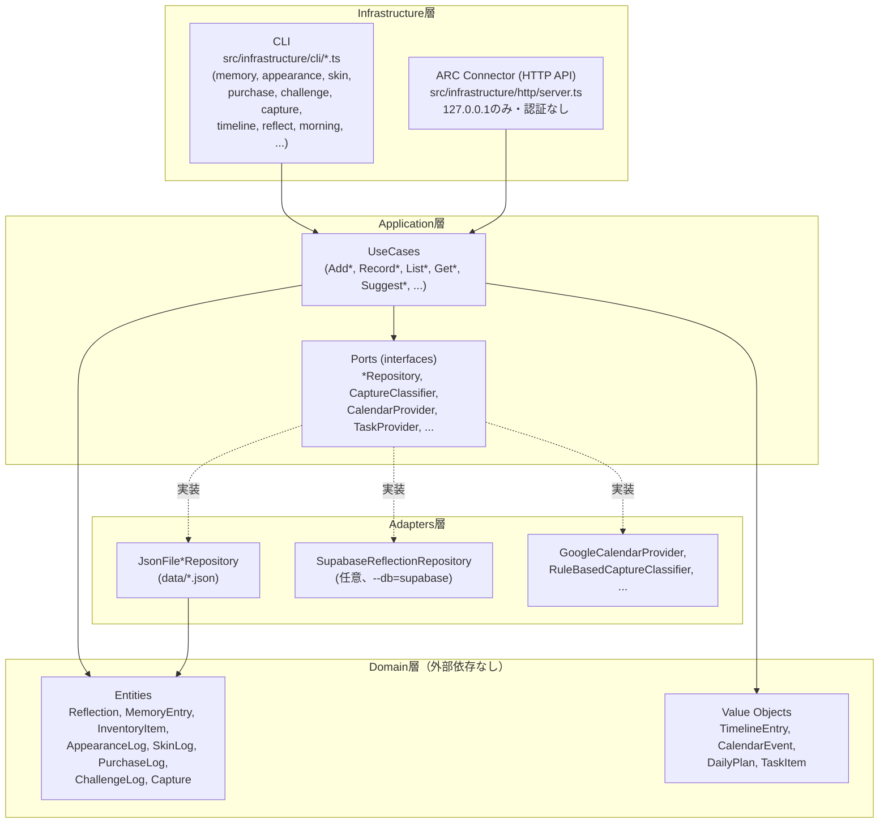
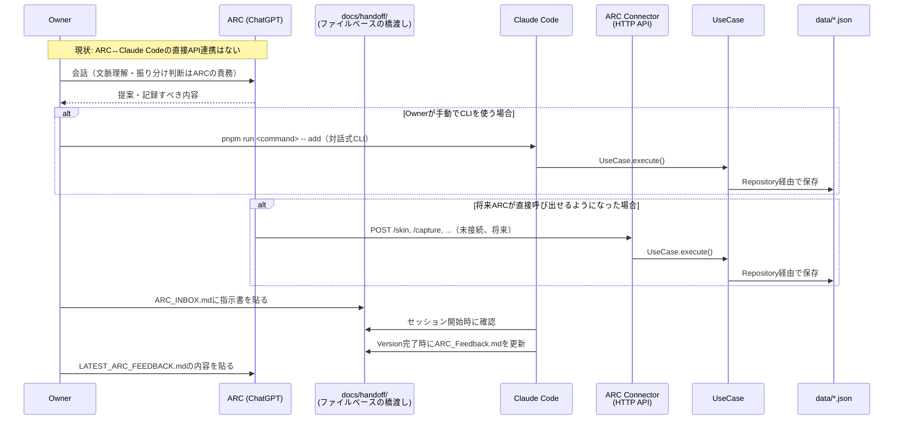

# Project ARC アーキテクチャ図

Version7完了時にOwnerから提案された、レイヤー構成・データの流れ・
ARCとの接続点を示す図（2026年7月、Version8時点の実装を反映）。
文章での説明は[`docs/architecture.md`](./architecture.md)を参照。

---

## 1. レイヤー構成（Clean Architecture）

依存の方向は常に外側→内側（Infrastructure/Adapters → Application →
Domain）。DomainとApplicationは、CLIかHTTP APIか、JSONファイルか
Supabaseかを一切知らない（Principle 8: 長期保守性）。

---

## 2. データの流れ（Owner・ARC・Systemの責務境界）

**Systemは判断しない**（`docs/ai-roles.md`、ADR 0007/0008）：
UseCase層はどのLogに書くべきかを判断せず、確定済みの入力を忠実に
保存するだけ。判断・解釈は常にARCまたはOwnerの側で行われる。

---

## 3. Logの境界（どの記録がどこへ行くか）

```mermaid
graph LR
    subgraph "瞬間の出来事（Timelineの対象、ADR 0009）"
        Reflection["Reflection\n(その日の振り返り、1日1件)"]
        AppearanceLog["AppearanceLog\n(月次の総合的な外見)"]
        SkinLog["SkinLog\n(肌の構造化記録、頻繁)"]
        PurchaseLog["PurchaseLog\n(消耗品の購入〜使い切り)"]
        ChallengeLog["ChallengeLog\n(人生初挑戦)"]
        Capture["Capture\n(Smart Captureの監査記録)"]
    end

    subgraph "継続的な状態（Timeline対象外）"
        Memory["MemoryEntry\n(時間に紐づかない知識、ADR 0005)"]
        Inventory["InventoryItem\n(耐久品の状態管理、ADR 0006)"]
    end

    Capture -.確定済みdestinations経由で書き込み.-> SkinLog
    Capture -.確定済みdestinations経由で書き込み.-> PurchaseLog
    Capture -.確定済みdestinations経由で書き込み.-> ChallengeLog
    Capture -.確定済みdestinations経由で書き込み.-> AppearanceLog
```

`pnpm find`（横断検索、ADR 0005）はMemoryとInventoryのみを対象と
し、`pnpm timeline`（ADR 0009）は上段の6つのみを対象とする。目的が
異なる別々の機能として併存させている。

---

## 4. ARCとの接続点（現状と将来）

| 接続点 | 現状（2026年7月） | 将来 |
|---|---|---|
| 指示の受け渡し | `docs/handoff/ARC_INBOX.md`にOwnerが手動で貼り付け | 変更なし（人間による意思決定の窓口として維持、Principle 1） |
| フィードバックの受け渡し | `docs/reports/VersionN_ARC_Feedback.md`をOwnerが手動でコピー | 変更なし |
| データの読み書き | ARCから直接は不可能。ARC ConnectorはOwnerがCLIまたは`curl`/`fetch`で手動操作する前提 | ChatGPT Actions・MCP等でARCが直接`POST /skin`等を呼べるようになる可能性（認証の実装が前提、ADR 0008） |
| 判断・分類 | 常にARCまたはOwner（Systemは判断しない、ADR 0007/0008） | 変わらない（Project ARCの根幹原則、`docs/ai-roles.md`） |
